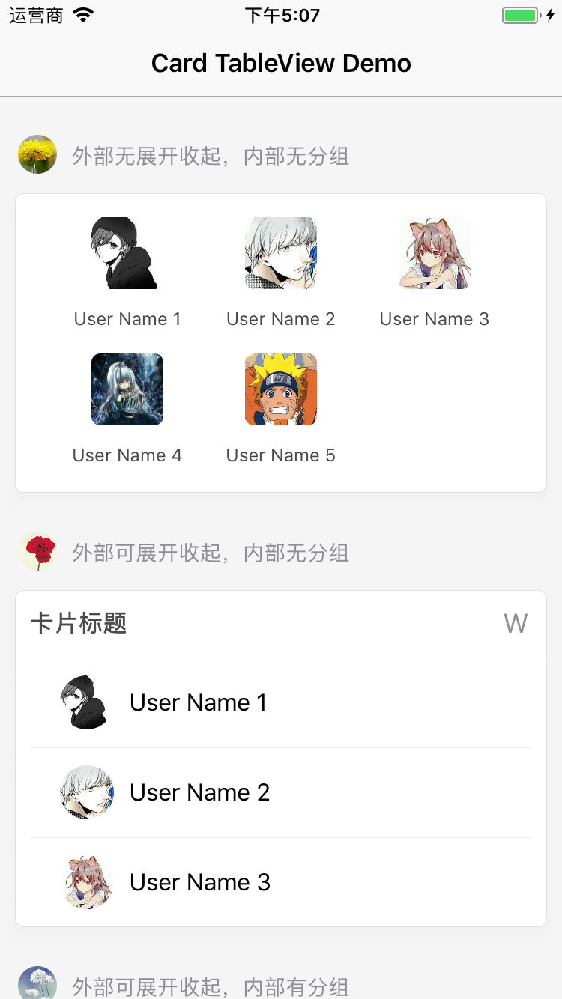
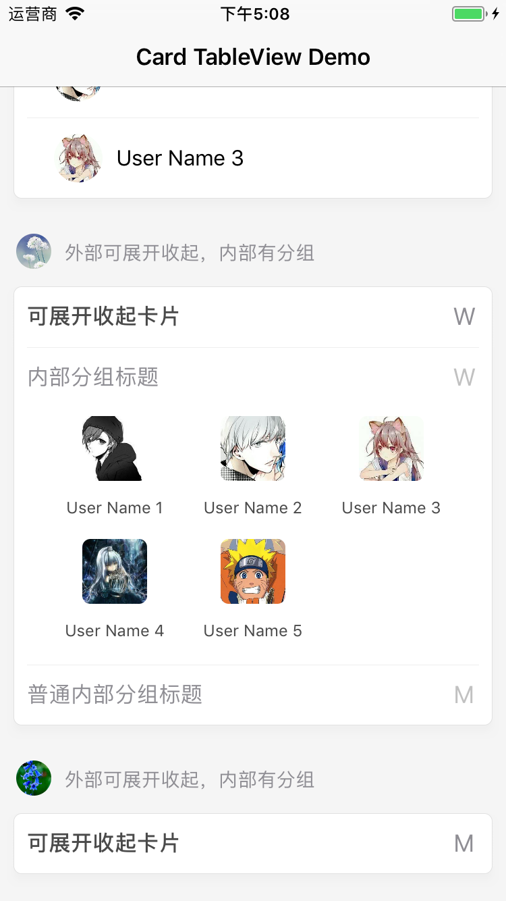

# HBTCardTableViewController

[](https://travis-ci.org/lovebzhou/HBTCardTableViewController)
[](https://cocoapods.org/pods/HBTCardTableViewController)
[](https://cocoapods.org/pods/HBTCardTableViewController)
[](https://cocoapods.org/pods/HBTCardTableViewController)


## Example






To run the example project, clone the repo, and run `pod install` from the Example directory first.

## Requirements

## Installation

HBTCardTableViewController is available through [CocoaPods](https://cocoapods.org). To install
it, simply add the following line to your Podfile:

```ruby
pod 'HBTCardTableViewController'
```

## Author

lovebzhou, tiny@gmail.com

## License

HBTCardTableViewController is available under the MIT license. See the LICENSE file for more info.
